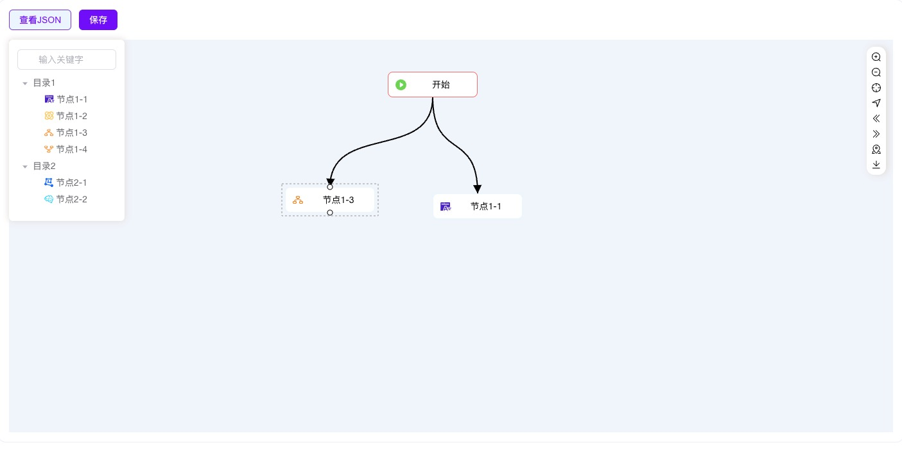
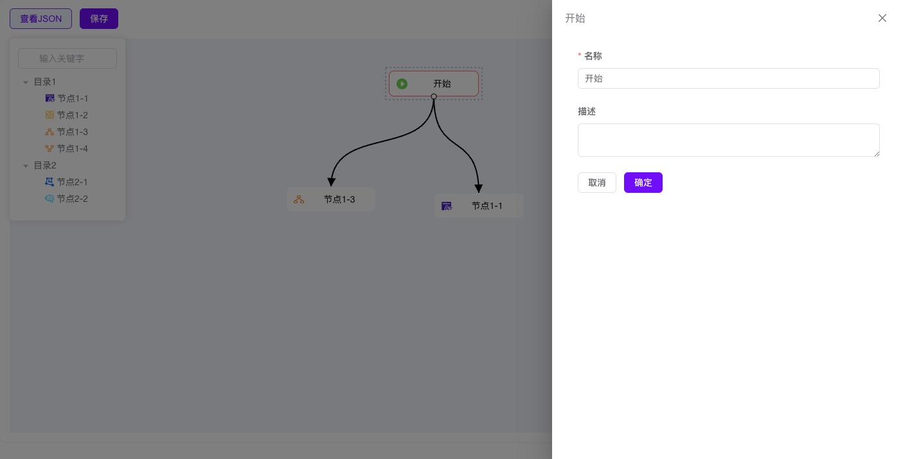

<div align="center">
  
</div>


## logicflow-vue3

🎉 logicflow+vue3+elementplus的流程编排

<div>
  
</div>
<div>
  
</div>


## 功能亮点

- 左侧树形，支持无数层

- 自定义节点图标+文字，样式美观


## 运行步骤

使用node18

```
npm config set registry https://registry.npmmirror.com/
npm install
npm run dev
```


## 项目集成

- 下载logicflow依赖

"@logicflow/core": "^1.2.26",

"@logicflow/extension": "^1.2.26"

- 把src/views/design目录复制到自己项目里即可


## 鸣谢

- https://github.com/didi/LogicFlow

- https://site.logic-flow.cn/examples


## 项目链接

- https://github.com/xoobom/logicflow-vue3

  


## 沟通交流

### QQ群

群号：692252235     

<div>
  
</div>


## 捐赠

如果您觉得这个项目帮助到了您，您可以捐赠 :moneybag: 表示鼓励 :coffee:
<div>
  
  
</div>